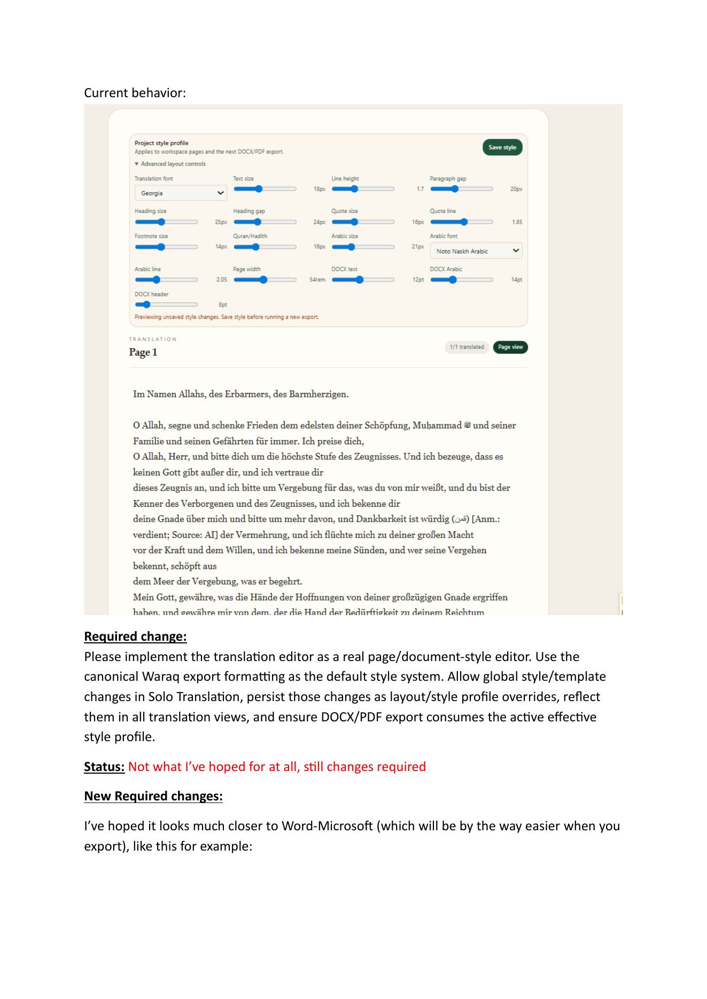
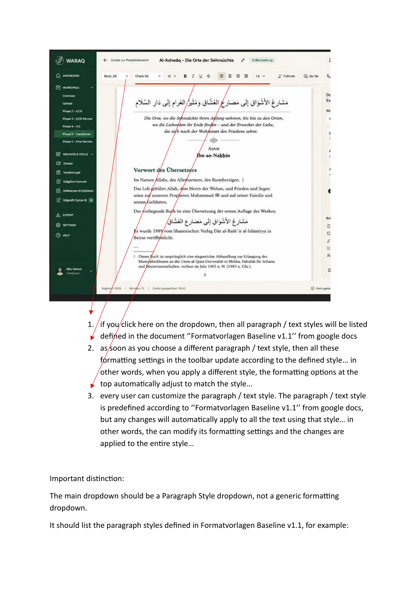
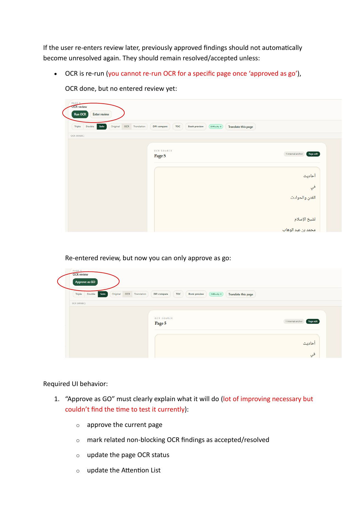
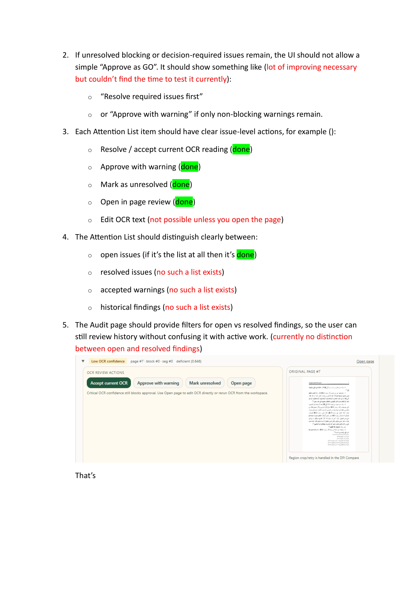
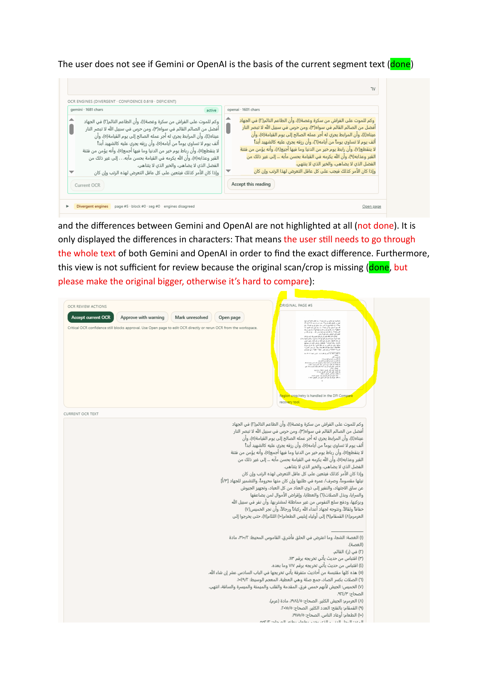
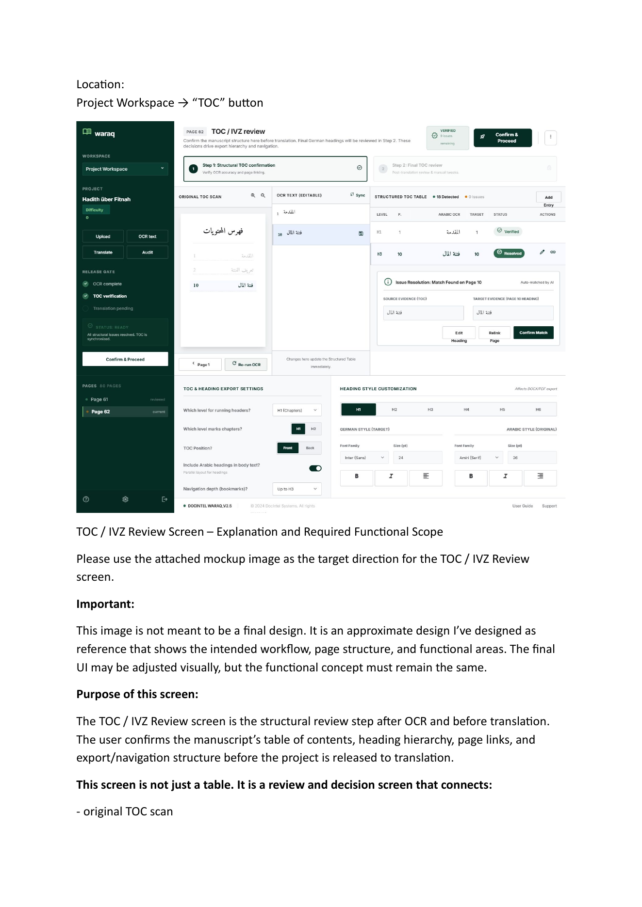

# Observations and Changes2 Implementation Plan

Date captured: 2026-05-28

## Source of Truth

`Observations and Changes2.pdf` is the authoritative follow-up scope for the next implementation pass.

Anything from `Observations and Changes.pdf` that is not mentioned again in `Observations and Changes2.pdf` is treated as already implemented or outside the current fix round.

Original references:

- `../../Observations and Changes.pdf`
- `../../Observations and Changes2.pdf`

Visual references rendered from `Observations and Changes2.pdf`:

- Translation editor current state: `assets/changes2-translation-editor-current.png`
- Translation editor target direction: `assets/changes2-translation-editor-target.png`
- OCR review rerun state: `assets/changes2-ocr-review-rerun.png`
- Attention List expanded issue view: `assets/changes2-attention-list-expanded.png`
- Attention List reason/label examples: `assets/changes2-attention-list-reasons.png`
- TOC / IVZ mockup: `assets/changes2-toc-ivz-mockup.png`

## 1. OCR Read/Edit View in Comparison Layouts

Latest status: implemented in this follow-up pass.

Solo OCR view is correct and should remain the reference implementation.

Implemented changes:

- Make OCR rendering in Original/OCR, OCR/Translation, and Triple views match the Solo OCR page view.
- Preserve paragraph breaks, visible block structure, spacing, RTL alignment, and readable Arabic sizing in comparison panes.
- Ensure OCR edit mode uses the same page-like structure in every layout.
- Avoid a separate compressed comparison rendering path.
- Fit the full OCR page width into narrow comparison panes.
- Scale OCR typography and page padding down proportionally in comparison panes instead of using horizontal scroll.
- Support OCR inline alignment markers such as `[[center]]...[[/center]]`, matching the app's existing alignment-marker model.

Implementation notes:

- Updated `Waraq/frontend/src/components/OcrPane.tsx`.
- Comparison modes already reused `OcrPane`; the mismatch came from responsive pane width shrinking the document frame.
- The OCR pane now measures available width and scales its page-like OCR rendering to fit.
- Verified with `npm run typecheck`; run `npm run build` after any additional edits.

## 2. Translation Editor / Word-Like Style System

Latest status: implemented.

Required changes:

- Replace the simplified style profile panel with a Word-like document editor toolbar.
- Add a Paragraph Style dropdown, not a generic formatting dropdown.
- List canonical paragraph styles from `Formatvorlagen Baseline v1.1`, for example:
  - `Body_DE`
  - `Body_DE_NoIndent`
  - `Heading 1` through `Heading 6`
  - `UeberschriftAR_1` through `UeberschriftAR_6`
  - `Quran_AR`, `Quran_DE`, `Quran_Quelle`
  - `Hadith_AR`, `Hadith_DE`, `Hadith_Quelle`
  - `Zitat_AR`, `Zitat_DE`, `Zitat_Quelle`
  - title, footnote, and TOC styles where applicable
- Keep character/inline styles separate from paragraph styles, for example:
  - `Begriff_AR`
  - `FussN_AR`
  - `FN_Uebersetzer`
  - `FN_Herausgeber`
  - `FN_Verlag`
- Store two separate values for every style:
  - `internal_style_key`: fixed canonical key, not editable by the user.
  - `display_label`: editable user-facing alias.
- Ensure export, preflight, template mapping, and style-integrity logic always use `internal_style_key`, never `display_label`.
- Add "Edit style..." / advanced style settings for global style-level edits.
- Allow users to adjust style-level properties defined in `Formatvorlagen Baseline v1.1`, including:
  - font family
  - font size
  - line spacing
  - spacing before
  - spacing after
  - first-line indent
  - left indent
  - paragraph alignment
  - RTL / LTR behavior
  - border / left rule for Quran, Hadith, and Quote block styles
  - tab stops where applicable, especially TOC-related styles
- Make style edits apply globally to all text using that style, not only the selected paragraph.
- Make Quran/Hadith/Quote buttons insert or apply structured block sequences:
  - Quran block: `Quran_AR` -> `Quran_DE` -> `Quran_Quelle`
  - Hadith block: `Hadith_AR` -> `Hadith_DE` -> `Hadith_Quelle`
  - Quote block: `Zitat_AR` -> `Zitat_DE` -> `Zitat_Quelle`
- Preserve baseline-defined indentation, spacing, and left border/rule for those block styles.
- Add account/project font-library support.
- Ensure fonts used in the editor are also available to server-side DOCX/PDF export.
- Never silently replace missing fonts with browser or server fallbacks.
- Treat missing critical baseline fonts as blocking before preflight:
  - `KFGQPC Uthmanic Script HAFS`
  - `Traditional Naskh`
  - `Noto Sans Arabic`
  - `Calibri`
- Ensure Solo Translation, Double views, Triple view, Book Preview, DOCX export, PDF export, and preflight all consume the active effective style profile.

Clarity to resolve during implementation:

- Answered: use TipTap / ProseMirror for the real-user editor foundation.
- Answered: editable user-facing labels can wait until after the core style system works.
- Answered: use server-available fonts first; missing canon-critical fonts should be surfaced and installed separately.
- Answered: first add the style system; Quran/Hadith/Quote structured block insertion comes afterward.

Implemented in this pass:

- Installed TipTap packages: `@tiptap/react`, `@tiptap/starter-kit`, and `@tiptap/extension-text-align`.
- Replaced the editable translation textarea with a TipTap editor surface while preserving segment anchors.
- Added a Word-like editable translation toolbar with paragraph style, font, size, bold, italic, underline, strike, alignment, line-height, footnote/Quran/Hadith/quote style actions, save style, and save page controls.
- Added canonical first-pass paragraph style definitions in `frontend/src/lib/translation-styles.ts`.
- Added per-style template records under `translation_style_templates`; each style has its own display label, font, size, line height, paragraph spacing, DOCX size, alignment, first-line indent, left indent, left-rule flag, italic, and bold values.
- Added an "Edit selected style template" panel. Changes apply globally to all paragraphs using that internal style key after saving the style profile.
- Persisted segment paragraph style keys through segment-scoped Decision Events:
  - decision type: `translation_paragraph_style_update`
  - decision source: `style_management`
  - content key: `internal_style_key`
- Added `PUT /segments/{satz_uuid}/translation-style`.
- Added `translation_style_key` to segment responses so the editor can reload saved style choices.
- Updated DOCX export to read segment style decisions and per-style templates, mapping internal style keys to DOCX paragraph styles and applying saved font/size/spacing/alignment/indent/bold/italic values.
- Added server font-library endpoint at `GET /projects/{project_uuid}/style-profile/fonts`.
- Toolbar font options now use server-available fonts when available.
- Toolbar surfaces missing critical fonts from the existing guard-near preflight check.
- Editable display labels are implemented inside the selected style-template editor.
- Quran/Hadith/Quote buttons apply the relevant three-part style sequence to the current and following anchored paragraphs:
  - Quran: `quran_de`, `quran_de`, `source_note`
  - Hadith: `hadith_de`, `hadith_de`, `source_note`
  - Quote: `quote_de`, `quote_de`, `source_note`

Implementation note:

- The structured block buttons apply canonical style sequences to existing anchored paragraphs. They do not create new text segments because the current Waraq text model requires segment anchors for persistence/history. Creating brand-new segments from the translation editor would be a separate text-structure editing feature.

Font status from local server check:

- Available: `Noto Sans Arabic`, `Noto Naskh Arabic`, `Noto Kufi Arabic`, `Noto Nastaliq Urdu`, `DejaVu`, `Liberation`, and many other Noto families.
- Missing or not confirmed locally: `KFGQPC Uthmanic Script HAFS`, `Traditional Naskh`, and `Calibri`.
- `Calibri` needs a licensed Microsoft font source if exact canon compliance is required; `Carlito` can be a fallback only if explicitly approved.
- `KFGQPC Uthmanic Script HAFS` should come from the official King Fahd Quran Complex font package or another trusted licensed source.
- `Traditional Naskh` should come from a licensed source or be replaced by an approved substitute in a later decision.

Verification:

- `backend/.venv/bin/python -m py_compile backend/waraq/translation_styles.py backend/waraq/api/routers/segments_router.py backend/waraq/api/schemas.py backend/waraq/export/docx_builder.py`
- `npm run typecheck`
- `npm run build`

Visual references:

## 3. OCR Review, Attention List, and Issue Lifecycle

Latest status: partially implemented in this follow-up pass.

Implemented in this pass:

- Added an Audit read path for resolved OCR review decisions:
  - `GET /projects/{project_uuid}/audit/ocr-review-decisions`
  - Uses existing page-level OCR review Decision Events as the source of truth.
- Added Audit tabs:
  - Active attention
  - Resolved OCR decisions
- Kept active attention focused on unresolved work.
- Grouped duplicate OCR attention signals for the same page/block/segment, so low confidence and divergent engines appear as one review group where they share a decision context.
- Added clearer reason labels and short explanations.
- Added action-result messages after OCR review actions.
- Enlarged the original scan preview in expanded OCR issue rows.
- Added inline difference highlighting for OCR engine alternatives.
- Added OpenAI-backed OCR difference explanations for alternative engine readings.
- Added ignored/deleted OCR attention decisions as segment-level Decision Events.
- Ignored/deleted OCR findings are hidden from Active attention and shown only inside an explicit `Ignored / deleted` filter in Resolved OCR decisions.
- Added `superseded by OCR retry` as a segment-level Decision Event state and explicit resolved filter.
- DPI retry acceptance now records candidate UUID, segment UUID, scope, engine, DPI, crop, changed flag, and character count on the superseded decision.
- Added navigation from page review back to the focused Audit attention item.

Existing backend behavior confirmed:

- Page approval already persists OCR review Decision Events.
- Page approval resolves non-blocking OCR error rows.
- Accepted OCR-PO attention rows are suppressed when the page-level OCR review decision is newer than the OCR result.
- Re-running OCR after approval naturally reopens active attention because the OCR-PO is newer than the prior decision.
- Ignored/deleted OCR attention rows are suppressed only when the segment-level ignore/delete Decision Event is newer than the OCR result.
- Superseded OCR attention rows are suppressed only when the segment-level superseded Decision Event is newer than the OCR result.

OCR difference note:

- Current inline highlighting remains a deterministic visual aid.
- OpenAI now acts as the reviewer/agent layer for full Arabic OCR-difference explanations. It compares Gemini as the primary OCR reading against OpenAI as the comparison reading, maps how OpenAI differs from Gemini line by line, adds character-level notes, and explains likely Arabic-specific causes such as harakat, hamza forms, dotting, ligatures, spacing, and normalization. It requires `OPENAI_API_KEY`; `OPENAI_OCR_DIFF_MODEL` can override the default `gpt-4o`.

Completion status:

- No Workstream 3 implementation gap remains for the current product surface.
- The persisted OCR lifecycle model is now in place through `ocr_attention_issues`.
- OCR retry candidates are now persisted through `ocr_retry_candidates` and can link to an OCR issue UUID.
- Backend attention rows now carry stable `issue_uuid`, `issue_state`, and `issue_group_key` fields for server-side lifecycle identity/grouping.
- Crop-level retry metadata is persisted on the retry candidate and linked superseded Decision Event. Region-specific replacement still resolves the mapped segment, because the current text model stores OCR at segment granularity.
- Resolved OCR decisions now include explicit filters for accepted, warning, unresolved, superseded, historical, and ignored/deleted states.

Implemented requirement checklist:

- Add one unified OCR finding lifecycle:
  - open
  - decision required
  - accepted / resolved
  - accepted with warning
  - unresolved
  - superseded by rerun OCR
  - historical
  - deleted / ignored
- Make "Approve as GO" persist a review decision and move non-blocking findings into resolved/accepted state.
- After "Approve as GO", update:
  - page OCR status
  - related OCR finding states
  - Audit counters
  - Attention List contents
- Default Attention List should show active unresolved work only.
- Add Audit filters or tabs:
  - Open findings
  - Blocking / decision required
  - Warnings
  - Accepted / resolved
  - Accepted with warning
  - Historical / superseded
  - Deleted / ignored
- Keep resolved or accepted findings available in a separate resolved/history view.
- Re-entering review must not reset accepted/resolved findings unless:
  - OCR is re-run
  - OCR text changes in a way that invalidates the previous decision
  - user explicitly resets review state
- "Approve as GO" must be unavailable if unresolved blocking or decision-required findings remain.
- Show "Resolve required OCR issues first" where blocking issues remain.
- Offer "Approve with warning" where only non-blocking warnings remain.
- Make issue-level actions persist and move findings into the correct state:
  - Accept current OCR reading
  - Accept alternative reading
  - Approve with warning
  - Mark unresolved
  - Edit OCR text
  - Open page review
  - Rerun OCR for this page/region if applicable
- After an action, show a clear confirmation message, for example:
  - "Finding accepted and moved to Resolved findings."
  - "Finding remains open because OCR confidence is still critical."
- Group multiple findings for the same page/block/segment into one finding group where they share one decision context.
- Improve reason labels so the user understands why the issue exists:
  - Low OCR confidence
  - Divergent engines
  - Critical confidence
  - Layout/order uncertainty
  - Footnote/small print risk
- Add short definitions/explanations for reason labels.
- Add inline difference highlighting between OCR alternatives.
- Do not rely only on character-count differences.
- Make the original scan/crop larger in the expanded issue view.
- Show which OCR reading is currently active.
- Add navigation back from page review to the exact Attention List item.
- Allow OCR rerun for a specific page/region after approval where applicable.

Clarity to resolve during implementation:

- Confirm the best persisted state model based on existing OCR finding tables and decision-event patterns.
- Confirm whether "deleted / ignored" is a soft state only or should hide findings from all normal history views.

Visual references:

## 4. TOC / IVZ Review Screen

Latest status: implemented as a persisted structural review station in `frontend/src/components/TocPanel.tsx`, `backend/waraq/toc/service.py`, and `backend/waraq/api/routers/toc_router.py`.

Required changes:

- Build the TOC / IVZ screen as a structural manuscript review station, not just a table.
- Make it clear that Step 1 is structural TOC confirmation before translation.
- Make it clear that Step 2 is final translated TOC review after translation.
- Include the main functional areas:
  - top workflow area
  - original TOC scan panel
  - editable OCR text panel
  - structured TOC table
  - issue resolution panel
  - release gate / confirm and proceed
  - TOC and heading export settings
  - heading-style customization only
- Original TOC scan panel must support:
  - original TOC page scan
  - zoom in / zoom out
  - page navigation if TOC spans multiple pages
  - selected-line highlight
  - synchronization with OCR text and structured TOC table
  - rerun OCR for TOC page
  - optional selected-area OCR if supported
- OCR text panel must support:
  - editable OCR lines
  - save/cancel correction
  - split line
  - merge lines
  - mark line as TOC entry
  - mark line as not TOC
  - synchronization with scan and structured table
  - protection of manual OCR corrections from silent overwrite
- Structured TOC table should include:
  - level
  - TOC page number
  - Arabic OCR heading
  - target page
  - target heading where space allows
  - status
  - translation heading preview
  - actions
- Structured TOC table actions should support:
  - select row
  - edit heading
  - change heading level
  - change target page
  - relink to another heading
  - confirm match
  - mark as not TOC entry
  - add missing entry from selected OCR/source/detected line
- "Add Entry" must be controlled and source-based, not a free manual TOC builder.
- Issue Resolution panel must explain:
  - what was detected in the TOC source
  - what was detected on the target page
  - why the match is OK, missing, verify, or mismatch
  - what the user can do to resolve it
- Release Gate must use one source of truth across:
  - sidebar gate status
  - top status
  - issue count
  - Confirm & Proceed button
- Confirm & Proceed must be disabled while blocking TOC issues remain.
- TOC and heading export settings must support:
  - which heading level appears in running headers
  - which heading level marks chapters
  - TOC position: front or back
  - whether Arabic headings appear in translated body text
  - navigation/bookmark depth
  - save to export profile
- Heading style customization on this screen is limited to heading styles only:
  - H1 through H6
  - translation heading style
  - Arabic heading style
- Do not include full document formatting here; body, Quran, Hadith, quote, footnote, and general layout styles belong in the Solo Translation editor / document formatting area.
- Add "Save heading style" and "Reset to baseline" actions.
- Make clear that heading style changes affect:
  - TOC preview
  - Book Preview
  - DOCX export
  - PDF export
- Re-detect TOC must produce suggestions and must not silently overwrite:
  - manually corrected OCR lines
  - confirmed target pages
  - confirmed heading levels
  - confirmed TOC entries

Implemented:

- Rebuilt the TOC panel into a TOC / IVZ review station matching the mockup workflow structure.
- Added top workflow area with Step 1 structural confirmation and Step 2 final translated review.
- Added release status badge and Confirm & Proceed gate; confirmation is disabled while blocking TOC issues remain.
- Added original scan panel with rendered source page, zoom controls, previous/next line navigation, selected-line highlight, persisted re-detect request, and a selected-area OCR handoff to the existing DPI recovery flow.
- Added persisted editable OCR lines panel with save/cancel correction, split, merge-next, mark TOC, mark not TOC, and protected/manual correction indicators.
- Added structured TOC table with level, page, Arabic OCR, target page, status, translation preview, select/edit/relink actions, and add-entry from selected source line.
- Added issue resolution panel showing source evidence, target evidence, status explanation, persisted target-page relink, persisted heading-level change, and persisted confirm-match action.
- Added TOC and heading export settings surface for running-header level, chapter level, TOC position, Arabic-heading display, navigation depth, and persisted save action.
- Added heading-style customization limited to heading styles, with H1-H6 selector, translation/Arabic preview, save heading style, and reset to baseline. It writes heading-relevant fields through the existing project style-profile endpoint.
- Backend TOC detection now returns replayed `ocr_lines`, stable line keys, manual/protected flags, entry status, target-page fields, and latest export settings.
- TOC line decisions, entry decisions, export settings, and re-detect requests are saved as project-scoped Decision Events. Detection replays these decisions after scanning current headings, so manual OCR corrections and confirmed decisions are preserved across refresh/re-detect.

Clarity to resolve during implementation:

- Selected-area OCR exists in the DPI recovery tool; the TOC screen opens that recovery flow for the selected page instead of duplicating crop OCR logic.
- Step 2 final translated TOC review is scaffolded as a workflow phase and becomes meaningful after structural confirmation/translation output.

Visual reference:

## 5. DPI Compare / OCR Retry Recovery

Latest status: implemented for the current page/segment lifecycle model.

Required changes:

- Keep the current DPI comparison setup stage.
- After "Retry selected region" or "Retry full page", show an OCR Retry Result Review panel or modal.
- The result review must include:
  - original crop / page region
  - current accepted OCR text
  - new OCR candidate
  - highlighted differences
  - confidence / reason labels
  - mapping target: page, block, segment, or OCR finding
  - original issue type if opened from Attention List
  - issue ID or page/block/segment reference
  - whether accepting the candidate will resolve the issue
- Add decision actions:
  - Accept new region OCR
  - Accept new full-page OCR
  - Keep current OCR
  - Edit manually
  - Discard retry result
- On accept:
  - update mapped OCR text
  - mark linked finding as resolved / replaced / accepted
  - remove old issue from active Attention List
  - keep the action in history/logs
- Re-running OCR for a selected crop must never silently replace the whole page.
- The UI must clearly ask whether the user wants to replace only the mapped region/segment or the entire page OCR result.

Implemented:

- Kept the existing low/high DPI comparison setup.
- After selected-region or full-page retry, the recovery tool now opens an OCR Retry Result Review panel.
- Result review includes:
  - original page/crop region preview
  - current accepted OCR text
  - new OCR candidate
  - editable candidate text after choosing Edit manually
  - highlighted candidate line differences
  - reason labels for changed/same OCR and segment mapping status
  - mapping target using page/segment references
  - source attention context when opened from Audit
  - acceptance effect copy explaining that acceptance updates mapped segment OCR and records a superseded retry decision
- Added decision actions:
  - Accept new region OCR / Accept new full-page OCR
  - Keep current OCR
  - Edit manually
  - Discard
- Audit OCR attention rows now include an Open DPI retry link that opens the workspace DPI panel with attention context.
- Acceptance updates OCR text, creates the `ocr_attention_superseded_by_rerun` Decision Event, removes the old issue from Active attention when the decision is newer than the OCR-PO, and leaves the action visible in resolved OCR decision history.

Clarity to resolve during implementation:

- Selected-region OCR exists backend-side through normalized crop rendering before OCR extraction.
- Persisted retry candidate versioning and linking to a specific OCR finding is implemented through `ocr_retry_candidates.issue_uuid`.

## Implementation Order

Recommended order:

1. OCR comparison rendering consistency.
2. OCR finding lifecycle and Attention List state model.
3. DPI retry result review, connected to the lifecycle model.
4. TOC / IVZ structural review screen.
5. Translation editor and canonical style system.

Reasoning:

- OCR comparison rendering is the smallest and most isolated follow-up.
- OCR finding lifecycle should come before DPI retry because retry acceptance depends on correct issue states.
- TOC / IVZ is a large workflow but can be built after the review-state model is stable.
- The translation editor/style system is the largest architectural item because it touches frontend editing, backend persistence, preflight, DOCX export, PDF export, and font availability.

## Implemented Architecture: True Crop-to-Finding Mapping

Status: implemented as part of closing Workstream 3 architecture.

Implemented model:

- `ocr_attention_issues` persists OCR issue UUIDs, project/page/block/segment references, issue type, state, severity, source OCR-PO UUID, group key, and details.
- `ocr_retry_candidates` persists retry candidate UUIDs, linked issue UUID where available, page/segment references, crop box, engine, DPI, candidate text, current-text snapshot, status, and linked Decision Event.
- Audit attention rows now expose stable issue identity fields.
- DPI retry candidate creation can receive and persist `issue_uuid`.
- Candidate acceptance links the superseded Decision Event back to the candidate and issue.

Current granularity note:

- The app's editable OCR text is still segment-level, so accepted crop retries update the mapped segment OCR. The crop itself is persisted for audit/history, but the text storage model does not yet split one segment into sub-segment crop ranges.

## Optional Future Extension: Span-Level Crop Replacement

Workstream 5 is complete for page/segment OCR retry recovery. A deeper optional extension would allow a selected crop to replace only a text span inside a segment instead of replacing the whole mapped segment OCR text.

Possible implementation:

- Add `ocr_text_spans` table with span UUID, segment UUID, source OCR-PO UUID, start/end character offsets or line/word anchors, optional crop box, text snapshot, confidence/reason metadata, and active flag.
- Add crop-to-span mapping during OCR retry:
  - use OCR line/word bounding boxes if an engine returns layout metadata
  - otherwise allow user confirmation by selecting the target line/span in the review UI
- Add span-level retry candidates:
  - link `ocr_retry_candidates` to either `issue_uuid` only or both `issue_uuid` and `span_uuid`
  - store candidate text for that span
- Add partial replacement UI:
  - show current full segment
  - highlight the mapped span
  - preview the full segment after replacement
  - actions: replace span only, replace whole segment, edit manually, discard
- Add text composition/readout support:
  - segment text remains the canonical export/readout value
  - span replacements either write a new segment revision with composed text or maintain span overlays that are composed before display/export
- Add audit/history support:
  - Decision Events should record `span_uuid`, crop, before-span text, after-span text, and resulting segment revision UUID when a text change is written.

This is not required for the current Workstream 5 completion because the present Waraq text model is segment-level.
